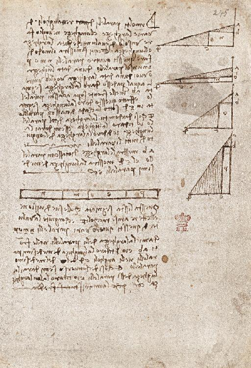

On what may be the last page he wrote in his notebooks, Leonardo Da Vinci drew four right triangles with bases of differing lengths (fig. below). Inside of each he fit a rectangle, and then he shaded the remaining areas of the triangle. In the center of the page he made a chart with boxes labeled with the letter of each rectangle, and below it he described what he was trying to accomplish. As he had done obsessively over the years, he was using the visualization of geometry to help him understand the transformation of shapes. Specifically, he was trying to understand the formula for keeping the area of a right triangle the same while varying the lengths of its two legs. He had fussed with this problem, explored by Euclid, repeatedly over the years. It was a puzzle that, by this point in his life, as he turned sixty-seven and his health faded, might seem unnecessary to solve. To anyone other than Leonardo, it may have been.1

Then abruptly, almost at the end of the page, he breaks off his writing with an “et cetera.” That is followed by a line, written in the same meticulous mirror script as the previous lines of his analysis, explaining why he is putting down his pen. “Perché la minestra si fredda,” he writes. Because the soup is getting cold.2

It is the final piece of writing we have by Leonardo’s hand, our last scene of him working. Picture him in the upstairs study of his manor house, with its beamed ceiling and fireplace and the view of his royal patron’s Château d’Amboise. Mathurine, his cook, is down in the kitchen. Perhaps Melzi and others of the household are already at the table. After all these years, he is still stabbing away at geometry problems that have not yielded the world very much but have given him a profound appreciation of the patterns of nature. Now, however, the soup is getting cold.1

---

### A better narration

In the Department of Manuscripts at the British Library is a sheet of geometrical notes by Leonardo da Vinci. It is one of his last pieces of writing: it probably dates from 1518, the year before he died. The paper is a dingy grey but the ink remains clear. There are some diagrams, and beside them a neatly blocked text written in his habitual, right-to-left ‘mirror-script’. It is not, on the face of it, one of Leonardo’s most exciting manuscripts, unless you happen to be an aficionado of Renaissance geometry. But it repays attention: it has a little twist in its tail. Three-quarters of the way down the page the text breaks off with an abrupt ‘etcetera’. The last line looks like part of the theorem – the handwriting has hardly wavered at all – but what it actually says is ‘perche la minesstra si fredda’. He has left off writing ‘because the soup is getting cold’.3

---

[1] Walter Isaacson, Leonardo Da Vinci, p511, p512, Simon & Schuster, 2017.

[2] Codex Arundel, 245v; Pedretti Commentary, 2:325 and plate 44; Carlo Pedretti, introduction to Leonardo’s Codex Arundel (British Library/Giunti, 1998); Nicholl, 1.

[3] [https://erenow.net/biographies/leonardo-da-vinci-the-flights-of-the-mind/1.php](https://erenow.net/biographies/leonardo-da-vinci-the-flights-of-the-mind/1.php)

