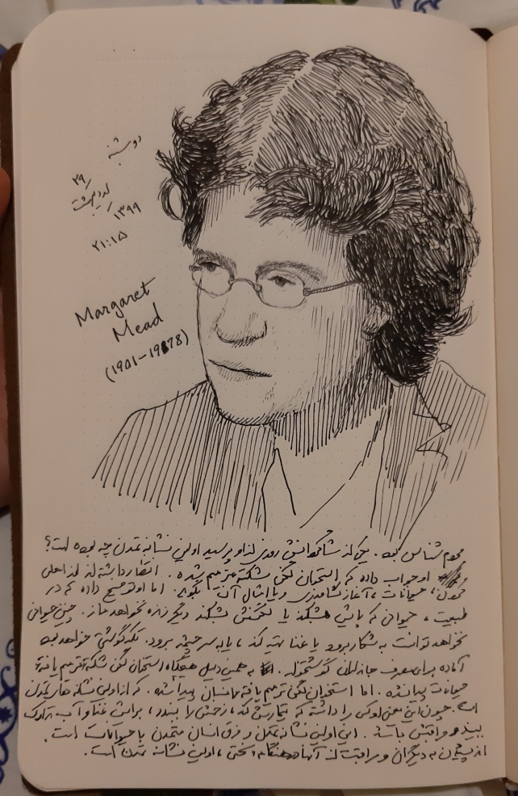

Years ago, anthropologist Margaret Mead was asked by a student what she considered the first sign of civilization in a culture. The student expected Mead to talk about fish hooks or clay pots or grinding stones. But no, Mead said that the first sign of civilization in an ancient culture was a femur (thighbone) that had been broken then healed. Mead explained, that in the animal kingdom, if you break your leg, you die. You can not run from danger, get to the river for a drink or hunt food. You are meat for prowling beasts. No animal survives a broken leg long enough for the bone to heal. A broken femur that has healed is proof that someone has taken time to stay with the person who has fell, has bound up the wound, has carried the person to safety and has tended the person through recovery. 

‘Helping someone through difficulty is where civilization starts’ said Mead. 

We are at our best when we serve others. Be civilized.”  

by Dr. Ira Byock, 
in his book on palliative medicine  
`The Best Care Possible: A Physician’s Quest to Transform Care Through the End of Life` (Avery, 2012).
